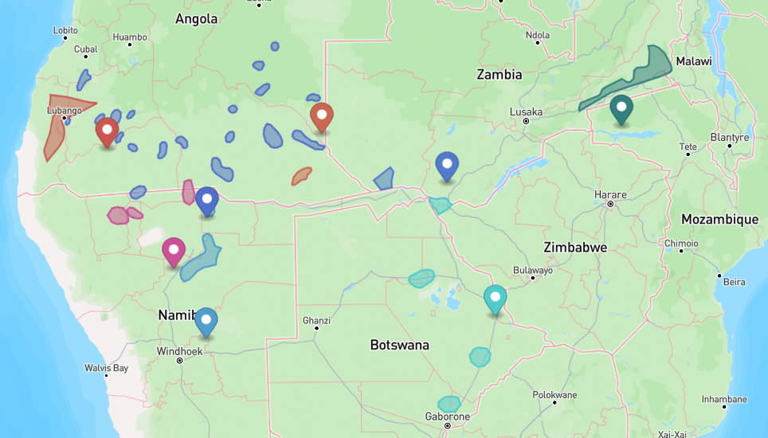
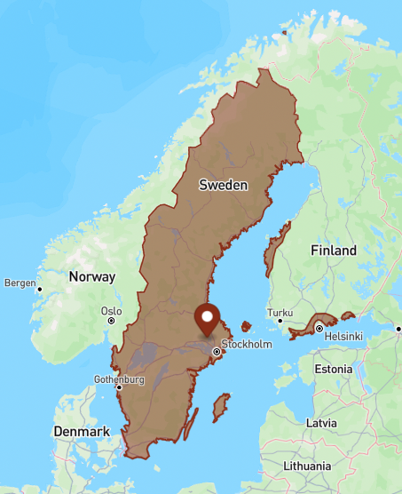
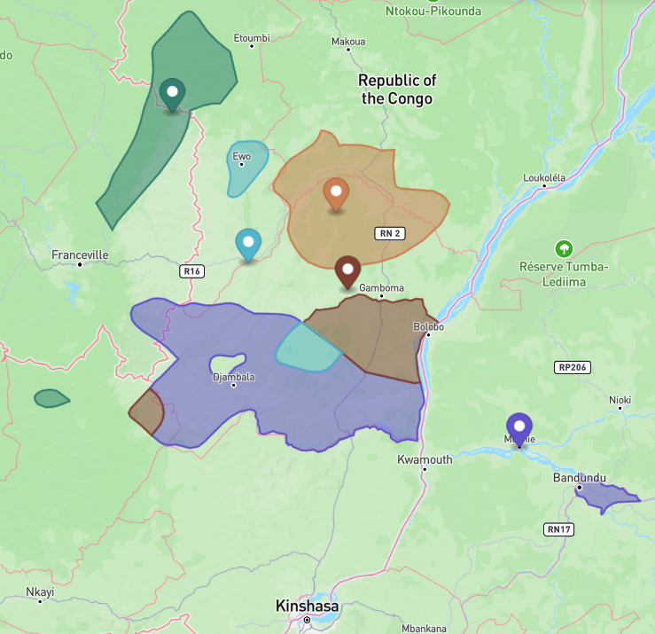
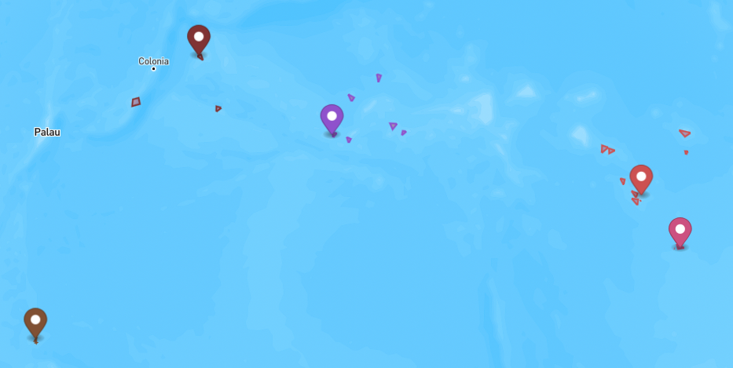
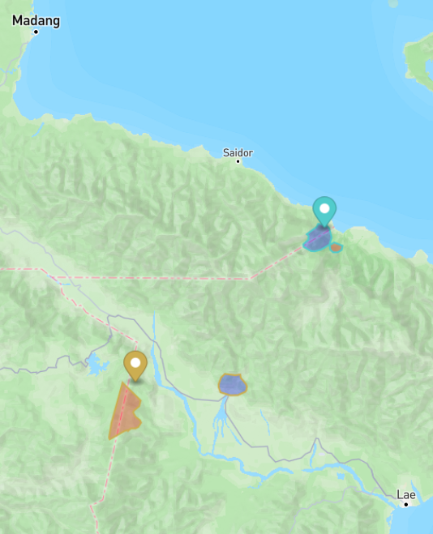
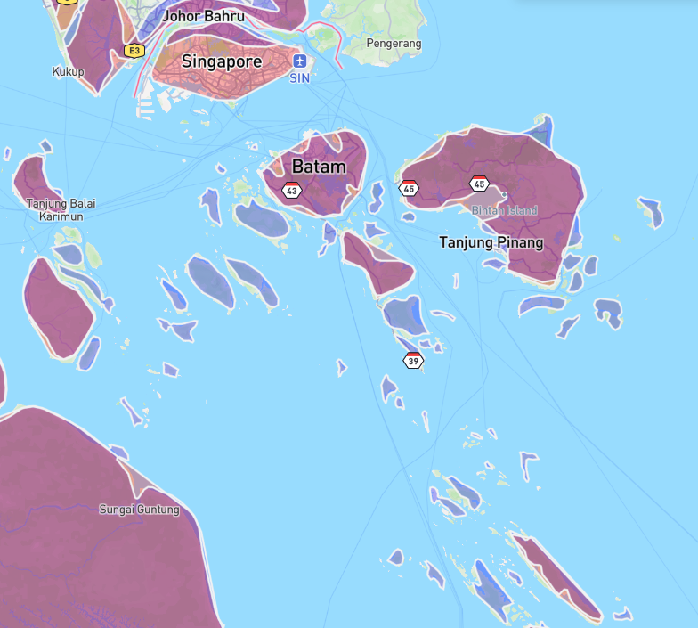
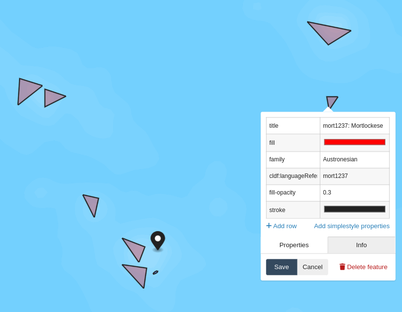
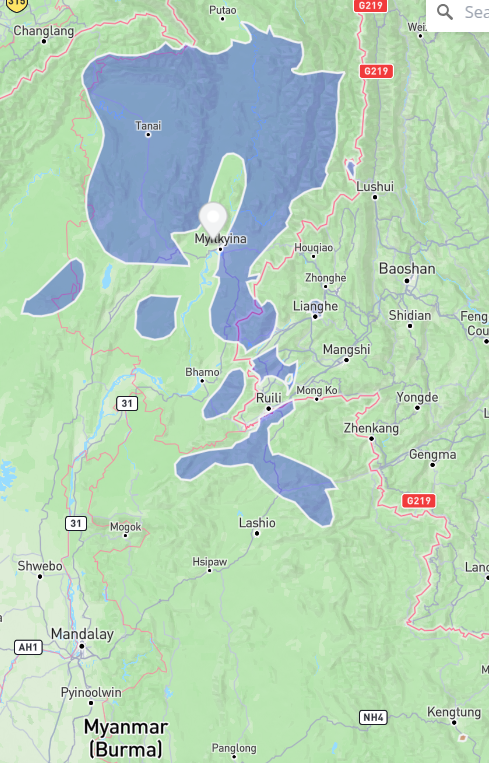
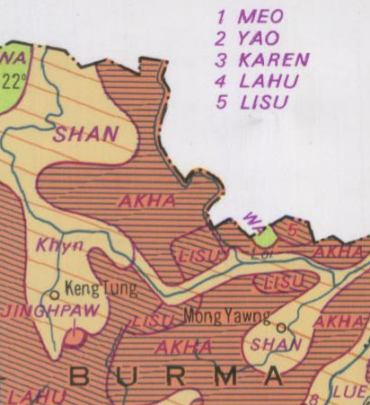

# Validation

Since this `cldfbench`-curated repository is used to create two CLDF datasets, we also have to run
the validation procedures on two sets.


## The *traditional* areas

First, we make sure the output is a valid CLDF dataset, i.e. data passes the type checks and foreign
keys meet referential integrity requirements:
```shell
cldf validate cldf/traditional
```

Next, we make sure all GeoJSON objects marked as speaker areas have valid geometries according to the 
[Simple Features standard](https://en.wikipedia.org/wiki/Simple_Features) (invalid geometries may
prevent operating on the geometries, e.g. computing distances, intersections, etc.):
```shell
cldfbench geojson.validate cldf/traditional
```


### Glottolog distance

To validate how well the speaker areas in the dataset correspond to "reality", we use Glottolog's point
coordinates for languages and compute the distances between speaker areas assigned to a language from
the corresponding point. This can be done by running a command from the [`cldfgeojson`](https://github.com/cldf/cldfgeojson)
package. We convert the resulting tab-separated table to proper CSV using the `csvformat` command from the
`csvkit` package and store the results in [etc/traditional/glottolog_distance.csv](etc/traditional/glottolog_distance.csv).
```shell
cldfbench geojson.glottolog_distance cldf/traditional --format tsv | csvformat -t > etc/traditional/glottolog_distance.csv
```
The results can be summarized using `csvstat`:
```shell
$ csvstat -c Distance,Contained etc/traditional/glottolog_distance.csv
  2. "Distance"

        Type of data:          Number
        Contains null values:  False
        Smallest value:        0
        Largest value:         11.238
        Most common values:    0 (2805x)

  3. "Contained"

        Type of data:          Boolean
        Contains null values:  False
        Most common values:    True (2487x)
                               False (1884x)

Row count: 4371
```
So, out of 4371 speaker areas which are matched to a Glottolog language with point coordinate
- 2805 had a distance of 0 which means the point coordinate was contained either in the area or
  in the convex hull of the area and
- 2487 speaker areas contained the point coordinate properly.

The largest reported distance is about 11.24 *grid units* in the Cartesian plane, i.e. about 1,200km
close to the equator. Clearly, the same language being located at places 1,200km apart seems suspicious.
Thus, we investigated outliers with regards to Glottolog distance and put explainable cases into an
"allowlist" at [etc/glottolog_distance_known.csv](etc/glottolog_distance_known.csv).

Let's inspect the unexplained cases with distance >= 1 grid unit. We can do this using a couple of commands
from the `csvkit` package: We first 
- join the "allowlist" to the table of distances, then
- filter cases with distance > 1 (i.e. distance not starting with the string `0.`)
- which are unexplained (i.e. with no `note` in the "allowlist").

We sort the result by distance, select only the `ID` and `Distance` columns and pipe the result into the
`termgraph` command:
```shell
csvjoin --left -c ID etc/traditional/glottolog_distance.csv etc/glottolog_distance_known.csv | csvgrep -c Distance -r"^0\.?" -i | csvgrep -i -c note -r".+" | csvsort -c Distance | csvcut -c ID,Distance | csvformat -E | termgraph

rung1258: ▇▇▇▇▇▇▇▇▇▇▇▇▇▇▇▇▇▇▇▇▇▇▇▇▇ 1.00 
ngoc1235: ▇▇▇▇▇▇▇▇▇▇▇▇▇▇▇▇▇▇▇▇▇▇▇▇▇ 1.01 
...
swah1253: ▇▇▇▇▇▇▇▇▇▇▇▇▇▇▇▇▇▇▇▇▇▇▇▇▇▇▇▇▇▇▇▇▇▇▇▇▇▇▇▇▇▇▇▇▇▇▇▇▇ 1.99 
deng1250: ▇▇▇▇▇▇▇▇▇▇▇▇▇▇▇▇▇▇▇▇▇▇▇▇▇▇▇▇▇▇▇▇▇▇▇▇▇▇▇▇▇▇▇▇▇▇▇▇▇▇ 1.99 
```
So there are no unexplained distances >2 grid units, i.e. about 200km close to the equator.

A distance of 200km still seems like a lot. So let's look at these cases on the map.
We can create a GeoJSON file containing speaker areas with Glottolog distance >= 1 and the corresponding Glottolog
point coordinate using the `geojson.geojson` command from the `cldfgeojson` package:
```shell
csvjoin --left -c ID etc/traditional/glottolog_distance.csv etc/glottolog_distance_known.csv | csvgrep -c Distance -r"^0\.?" -i | csvgrep -i -c note -r".+" | csvsort -c Distance | csvcut -c ID | cldfbench geojson.geojson --glottolog-version v5.1 cldf/traditional -  > etc/traditional/glottolog_distance_outliers.geojson
```

The resulting [GeoJSON file](etc/traditional/glottolog_distance_outliers.geojson) can be inspected using tools like QGIS, or https://geojson.io
Often, Glottolog distances > 0 can be explained by fractured speaker areas, with Glottolog using some kind of midpoint for its point coordinate,
as can be seen here




### MultiPolygon spread

The above method cannot detect cases where multiple ``raw`` shapes (e.g. for different dialects of a language)
have been aggregated to a multi-polygon with one shape being correctly matched to Glottolog, but others not,
because this would be reported as distance 0. Thus, we use a second method that computes how spread out
polygons in a multi-polygon area are. Big spread may be an indication of incorrect Glottolog matches.

To compute the spread of polygons in multi-polygon shapes we run another command of the `cldfgeojson` package
and store the results in [etc/traditional/multipolygon_spread.csv](etc/traditional/multipolygon_spread.csv).
```shell
cldfbench geojson.multipolygon_spread cldf/traditional --format tsv | csvformat -t > etc/traditional/multipolygon_spread.csv
```

Again, big spread does not necessarily mean an error. E.g. languages spoken by nomadic people in Siberia are
often reported in multiple disjoint areas which can spread over enormous distances. Thus, we again investigated
outliers and listed explainable cases in an "allowlist" at [etc/multipolygon_spread_known.csv](etc/multipolygon_spread_known.csv).

We summarize the unexplained cases in a similar way to above
```shell
csvjoin --left -c ID etc/traditional/multipolygon_spread.csv etc/multipolygon_spread_known.csv | csvgrep -c Spread -r"^0\.?" -i | csvgrep -i -c note -r".+" | csvsort -c Spread | csvcut -c ID,Spread | csvformat -E | termgraph

...
chuk1273: ▇▇▇▇▇▇▇▇▇▇▇▇▇▇▇▇▇▇▇▇▇▇▇▇▇▇▇▇▇▇▇▇▇▇▇▇▇▇▇▇▇▇▇▇▇▇▇▇▇ 3.92 
swed1254: ▇▇▇▇▇▇▇▇▇▇▇▇▇▇▇▇▇▇▇▇▇▇▇▇▇▇▇▇▇▇▇▇▇▇▇▇▇▇▇▇▇▇▇▇▇▇▇▇▇ 3.93 
viet1252: ▇▇▇▇▇▇▇▇▇▇▇▇▇▇▇▇▇▇▇▇▇▇▇▇▇▇▇▇▇▇▇▇▇▇▇▇▇▇▇▇▇▇▇▇▇▇▇▇▇▇ 3.96 
```
confirming no unexplained spread > 4.

Again, we can create a [GeoJSON file](etc/traditional/multipolygon_spread_outliers.geojson) containing multi-polygons with spread >= 3 for further investigation:
```shell
csvjoin --left -c ID etc/traditional/multipolygon_spread.csv etc/multipolygon_spread_known.csv | csvgrep -c Spread -r"^([012])\.?" -i | csvgrep -i -c note -r".+" | csvsort -c Spread | csvcut -c ID | cldfbench geojson.geojson --glottolog-version v5.1 cldf/traditional -  > etc/traditional/multipolygon_spread_outliers.geojson
```
Cases with big spread can often be explained as speaker areas on mulitple islands.



Smaller spread can still be a reason of incorrect Glottolog matching. Thus, we investigate multi-polygons with spread >=1, but leave out cases where the shape consists of more than 2 polygons (effectively leaving out very fractured speaker areas).
```shell
csvjoin --left -c ID etc/traditional/multipolygon_spread.csv etc/multipolygon_spread_known.csv | csvgrep -c Spread -r"^0\.?" -i | csvgrep -i -c note -r".+" | csvgrep -c NPolys -r"^([12])$" | csvsort -c Spread | csvcut -c ID | cldfbench geojson.geojson --glottolog-version v5.1 cldf/traditional -  > etc/traditional/multipolygon_spread_outliers_2.geojson
```
[Cases where a speaker area consists of two polygons](etc/traditional/multipolygon_spread_outliers.geojson), with the Glottolog coordinate somewhere between these can generally be
regarded as unproblematic.




### Comparison with Wurm & Hattori

The information in Asher & Moseley's Atlas was aggregated from multiple sources. A major source for the languages
of [Papunesia](https://glottolog.org/meta/glossary#macroarea) was Wurm & Hattori's ["Language Atlas of the Pacific Area"](https://glottolog.org/resource/reference/id/58497)
from 1983. Since Wurm & Hattori's Atlas has been [digitized](https://ecaidata.org/dataset/pacific-language-atlas-gis) and
a corresponding [CLDF dataset](https://doi.org/10.5281/zenodo.15183865) has been published, we can investigate the
overlap between our dataset and Wurm & Hattori easily.


```shell
$ csvstat -c Glottolog_Languoid_Level cldf/traditional/languages.csv 
/home/robert/venvs/glottography/lib/python3.12/site-packages/agate/table/from_csv.py:83: RuntimeWarning: Error sniffing CSV dialect: Could not determine delimiter
  kwargs['dialect'] = csv.Sniffer().sniff(sample)
  9. "Glottolog_Languoid_Level"
        Most common values:    language (4382x)
                               family (228x)

Row count: 4610
$ csvstat -c Glottolog_Languoid_Level ../../cldf-datasets/languageatlasofthepacificarea/cldf/languages.csv 
  9. "Glottolog_Languoid_Level"
        Most common values:    language (1776x)
                               family (97x)

Row count: 1873

$ csvjoin -c ID ../../cldf-datasets/languageatlasofthepacificarea/cldf/languages.csv cldf/traditional/languages.csv | csvstat -c Glottolog_Languoid_Level
  9. "Glottolog_Languoid_Level"
        Most common values:    language (1489x)
                               family (94x)

Row count: 1583
```

So about a third of the World Atlas' languages are also covered in Wurm & Hattori.

We can compare the speaker areas associated with these using the `geojson.compare` command provided by
the `cldfgeojson` package
```shell
cldfbench geojson.compare cldf/traditional/ ../../cldf-datasets/languageatlasofthepacificarea/cldf/ --format tsv | csvformat -t > etc/traditional/wh_comparison.csv
```
and get a quick overview of the results:
```shell
$ csvstat -c Distance etc/traditional/wh_comparison.csv
  ...
  2. "Distance"

        Type of data:          Number
        Unique values:         35
        Smallest value:        0
        Largest value:         3.67
        Most common values:    0 (1549x)
```
So for 1549 of the 1583 shared Glottocodes the speaker areas are overlapping (i.e. have distance 0) - which we can take as
positive validation of our dataset.

For 35, though, this was not the case. Again, we can write these shapes to [a GeoJSON file](etc/traditional/wh_nonintersecting.geojson) using `geojson.geojson`:
```shell
csvgrep -c Distance -r "^0\.0$" -i etc/traditional/wh_comparison.csv | csvcut -c Glottocode | csvformat -E | cldfbench geojson.geojson cldf/traditional/ --dataset2 ../../cldf-datasets/languageatlasofthepacificarea/cldf - > etc/traditional/wh_nonintersecting.geojson
```
and investigate the cases on the map. Clearly, one category of such non-intersecting areas are the tiny islands
of Micronesia, where W&H polygons are somewhat "off":



Another category requires checking back with the actual Atlases: cases where there is genuine disagreement
between the sources appear for example in Northern New Guinea:



A third category are possible errors, which require further checking and possibly repair, e.g.
https://github.com/Glottography/asher2007world/issues/1


Checking whether areas overlap is just one way to assess similarity between the areas from the two
sources. `geojson.compare` also computes absolute and relative differences in the number of polygons
aggregated into areas in both datasets:
```shell
$ csvstat -c NPolys_Diff,NPolys_Ratio etc/traditional/wh_comparison.csv
  3. "NPolys_Diff"

        Type of data:          Number
        Smallest value:        -357
        Largest value:         18
        Most common values:    0 (1238x)
                               1 (93x)
                               -1 (91x)
                               -2 (24x)
                               2 (22x)

  4. "NPolys_Ratio"

        Type of data:          Number
        Smallest value:        0.003
        Largest value:         7
```
These numbers are a bit harder to interpret: `NPolys_Diff` gives the number of polygons that the
W&H area has in addition to the A&M area. So there's one area which is represented by a shape with
357 more polygons in A&M! It turns out that this is the aggregated area for `aust1307` - the huge
Austronesian language family. The much higher count in A&M can easily be explained by the areas in A&M
being much more detailed, e.g. including small islands off the coast as individual polygons. The screenshot
below shows A&M polygons with blue fill, W&H polygons with reddish fill and the overlapping regions
in violet.



But `NPolys_Ratio` tells us, that there are also areas in W&H with 7 times as many polygons as the
corresponding areas in A&M. Let's look at these:
```shell
$ csvgrep -c NPolys_Ratio -r"^7\." etc/traditional/wh_comparison.csv | csvcut -c Glottocode,NPolys_Ratio
Glottocode,NPolys_RelDiff
engg1245,6.0
mort1237,6.0
sout2746,6.0
```

We can put them [on a map](etc/traditional/wh_reldiff6.geojson):
```shell
$ cldfbench geojson.geojson cldf/traditional --dataset2 ../../cldf-datasets/languageatlasofthepacificarea/cldf engg1245 mort1237 sout2746 >  etc/traditional/wh_reldiff6.geojson 
```
The screenshot below shows that W&H in fact has 7 times as many polygons than A&M for areas
where [Mortlockese](https://glottolog.org/resource/languoid/id/mort1237) is spoken:



One can also see that W&H's polygons for small islands often exceed the actual landmasses by a lot.
Thus, the last metric computed by `geojson.compare` - the area ratio - also needs
to be interpreted within this context:
```shell
$ csvstat -c Area_Ratio etc/traditional/wh_comparison.csv
  5. "Area_Ratio"

        Type of data:          Number
        Smallest value:        0
        Largest value:         547.711

Row count: 1583
```

The area with almost 550 times the size in W&H than in A&M is [Woleaian](https://glottolog.org/resource/languoid/id/wole1240) - 
another Micronesian language represented with a hugely exaggerated polygon in W&H. The area with ratio "0"
is mapped to [Southern Jinghpaw](https://glottolog.org/resource/languoid/id/kach1280):
```shell
$ csvgrep -c Area_Ratio -r"^0\.000" etc/traditional/wh_comparison.csv
Glottocode,Distance,NPolys_Diff,NPolys_Ratio,Area_Ratio
kach1280,2.2025393041267174,-7,0.125,0.0007170394462210619
```

Let's look at this case [on a map](etc/traditional/wh_areasize.geojson):
```shell
cldfbench geojson.geojson cldf/traditional --dataset2 ../../cldf-datasets/languageatlasofthepacificarea/cldf kach1280 >  etc/traditional/wh_areasize.geojson
```

Where A&M have a sizeable area right where Glottolog locates the language, too, W&H only depict a tiny
polygon somewhat far away in the lower right corner:



While this looks like a potential error, it can be explained by W&H's maps just "ending" a bit North
of the Thailand-Myanmar border, with just a small "JINGHPAW"-labeled pocket depicted:




## The *contemporary* areas

No we run through the same set of steps for the set of *contemporary* areas:
```shell
cldf validate cldf/contemporary
```

```shell
cldfbench geojson.validate cldf/contemporary
```

### Glottolog distance

Compute distances of language-level speaker areas to corresponding Glottolog point coordinate:
```shell
cldfbench geojson.glottolog_distance cldf/contemporary --format tsv | csvformat -t > etc/contemporary/glottolog_distance.csv
```

Using the same "allowlist" as above, we can print the unexplained cases with distance >= 1 grid unit:
```shell
csvjoin --left -c ID etc/contemporary/glottolog_distance.csv etc/glottolog_distance_known.csv | csvgrep -c Distance -r"^0\.?" -i | csvgrep -i -c note -r".+" | csvsort -c Distance | csvcut -c ID,Distance | csvformat -E | termgraph
...
mikm1235: ▇▇▇▇▇▇▇▇▇▇▇▇▇▇▇▇▇▇▇▇▇▇▇▇▇▇▇▇▇▇▇▇▇▇▇▇▇ 7.16 
west2618: ▇▇▇▇▇▇▇▇▇▇▇▇▇▇▇▇▇▇▇▇▇▇▇▇▇▇▇▇▇▇▇▇▇▇▇▇▇▇▇▇▇▇▇▇▇▇▇▇▇ 9.58 
cent2136: ▇▇▇▇▇▇▇▇▇▇▇▇▇▇▇▇▇▇▇▇▇▇▇▇▇▇▇▇▇▇▇▇▇▇▇▇▇▇▇▇▇▇▇▇▇▇▇▇▇▇ 9.60 
```
Larger distances can generally be explained by displacement of populations during colonialism.
```shell
csvjoin --left -c ID etc/contemporary/glottolog_distance.csv etc/glottolog_distance_known.csv | csvgrep -c Distance -r"^(0|1)\.?" -i | csvgrep -i -c note -r".+" | csvsort -c Distance | csvcut -c ID | cldfbench geojson.geojson --glottolog-version v5.1 cldf/contemporary -  > etc/contemporary/glottolog_distance_outliers.geojson
```
See for example Glottolog's point coordinate for [Central Ojibwe](https://glottolog.org/resource/languoid/id/cent2136) in relation to the Ojibwe reservations in Minnesota:


### MultiPolygon spread

```shell
cldfbench geojson.multipolygon_spread cldf/contemporary --format tsv | csvformat -t > etc/contemporary/multipolygon_spread.csv
```

```shell
csvjoin --left -c ID etc/contemporary/multipolygon_spread.csv etc/multipolygon_spread_known.csv | csvgrep -c Spread -r"^0\.?" -i | csvgrep -i -c note -r".+" | csvsort -c Spread | csvcut -c ID,Spread | csvformat -E | termgraph
```
There should be no unexplained spread > 4.

Investigate multi-polygons with spread >= 3:
```shell
csvjoin --left -c ID etc/contemporary/multipolygon_spread.csv etc/multipolygon_spread_known.csv | csvgrep -c Spread -r"^([012])\.?" -i | csvgrep -i -c note -r".+" | csvsort -c Spread | csvcut -c ID | cldfbench geojson.geojson --glottolog-version v5.1 cldf/contemporary -  > etc/contemporary/multipolygon_spread_outliers.geojson
```
These generally "make sense", i.e. correspond to spread-out languages.

Investigate multi-polygons with spread >=1, consisting of only 2 polygons:
```shell
csvjoin --left -c ID etc/contemporary/multipolygon_spread.csv etc/multipolygon_spread_known.csv | csvgrep -c Spread -r"^0\.?" -i | csvgrep -i -c note -r".+" | csvgrep -c NPolys -r"^([12])$" | csvsort -c Spread | csvcut -c ID | cldfbench geojson.geojson --glottolog-version v5.1 cldf/contemporary -  > etc/contemporary/multipolygon_spread_outliers.geojson
```
These also look reasonable.


## Conclusion

With the procedures detailed above we make sure
- the datasets are interoperable with relevant software and
- the data are in general agreement with public estimates of language locations.
